# Articulated Object GIF Gallery

1066 animated previews of articulated 3D objects, covering 531 object categories.

## Gallery

48 representative clips, one per tile. Click any tile to open the full-size 384x384 GIF.
Tiles are lightweight 160x160 previews kept in [`thumbs/`](thumbs/); the full-resolution originals live in [`gifs/`](gifs/).

<table>
<tr>
<td align="center"><a href="gifs/Other_Air_conditioner_seed_0023.gif">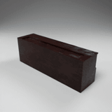</a><br><code>Other_Air_conditioner</code></td>
<td align="center"><a href="gifs/Urban_Environment_Caster_Trolley_seed_0142.gif">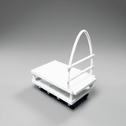</a><br><code>Urban_Environment_Caster_Trolley</code></td>
<td align="center"><a href="gifs/Container_Barrel_seed_0832.gif">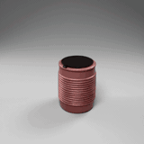</a><br><code>Container_Barrel</code></td>
<td align="center"><a href="gifs/Sports_Baby_cycle_seed_0006.gif">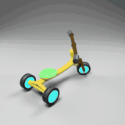</a><br><code>Sports_Baby_cycle</code></td>
</tr>
<tr>
<td align="center"><a href="gifs/Handtools_Clamp_seed_0017.gif">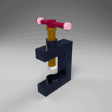</a><br><code>Handtools_Clamp</code></td>
<td align="center"><a href="gifs/Technology_Audio_Device_seed_1388.gif">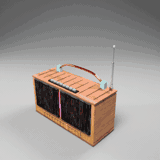</a><br><code>Technology_Audio_Device</code></td>
<td align="center"><a href="gifs/Door_Door_seed_0025.gif">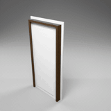</a><br><code>Door_Door</code></td>
<td align="center"><a href="gifs/Folding_ruler_seed_0109.gif">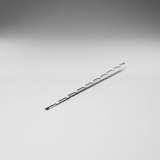</a><br><code>Folding_ruler</code></td>
</tr>
<tr>
<td align="center"><a href="gifs/Military_Aircraft_seed_0024.gif">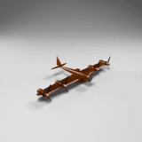</a><br><code>Military_Aircraft</code></td>
<td align="center"><a href="gifs/Astronomy_Antenna_dish_seed_0130.gif">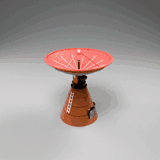</a><br><code>Astronomy_Antenna_dish</code></td>
<td align="center"><a href="gifs/Industrial_Blast_door_seed_0024.gif">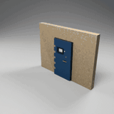</a><br><code>Industrial_Blast_door</code></td>
<td align="center"><a href="gifs/Kitchen_Air_fryer_seed_0020.gif">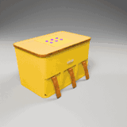</a><br><code>Kitchen_Air_fryer</code></td>
</tr>
<tr>
<td align="center"><a href="gifs/Electrical_Wiring_Cable_reel_seed_0001.gif">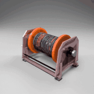</a><br><code>Electrical_Wiring_Cable_reel</code></td>
<td align="center"><a href="gifs/Equipment_Control_panel_seed_2578.gif">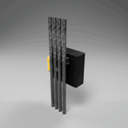</a><br><code>Equipment_Control_panel</code></td>
<td align="center"><a href="gifs/Science_Capsule_seed_0019.gif">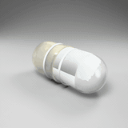</a><br><code>Science_Capsule</code></td>
<td align="center"><a href="gifs/Stationary_Calculater_seed_0007.gif">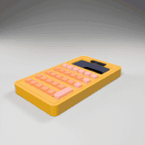</a><br><code>Stationary_Calculater</code></td>
</tr>
<tr>
<td align="center"><a href="gifs/Healthcare_Adjustable_hospital_bed_seed_0036.gif">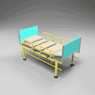</a><br><code>Healthcare_Adjustable_hospital_bed</code></td>
<td align="center"><a href="gifs/Music_Amplifier_seed_0052.gif">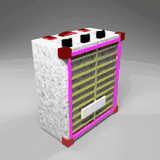</a><br><code>Music_Amplifier</code></td>
<td align="center"><a href="gifs/Bag_Suitcase_Box_seed_0977.gif">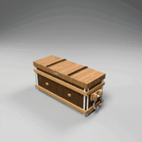</a><br><code>Bag_Suitcase_Box</code></td>
<td align="center"><a href="gifs/Playground_Seesaw_seed_0074.gif">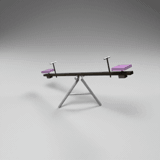</a><br><code>Playground_Seesaw</code></td>
</tr>
<tr>
<td align="center"><a href="gifs/Cabinet_with_doors_seed_1915.gif">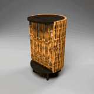</a><br><code>Cabinet_with_doors</code></td>
<td align="center"><a href="gifs/Bathroom_Hair_dryer_seed_1942.gif">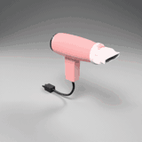</a><br><code>Bathroom_Hair_dryer</code></td>
<td align="center"><a href="gifs/Other_Vent_seed_0220.gif">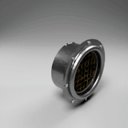</a><br><code>Other_Vent</code></td>
<td align="center"><a href="gifs/Urban_Environment_Public_toilet_seed_0325.gif">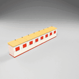</a><br><code>Urban_Environment_Public_toilet</code></td>
</tr>
<tr>
<td align="center"><a href="gifs/Container_Jar_seed_0042.gif">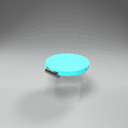</a><br><code>Container_Jar</code></td>
<td align="center"><a href="gifs/Sports_Roller_scates_seed_0007.gif">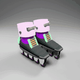</a><br><code>Sports_Roller_scates</code></td>
<td align="center"><a href="gifs/Air_blower_seed_0129.gif">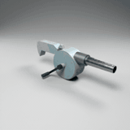</a><br><code>Air_blower</code></td>
<td align="center"><a href="gifs/Fountain_Drick_fountain_seed_0262.gif">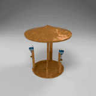</a><br><code>Fountain_Drick_fountain</code></td>
</tr>
<tr>
<td align="center"><a href="gifs/Machinery_Watermill_seed_0225.gif">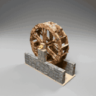</a><br><code>Machinery_Watermill</code></td>
<td align="center"><a href="gifs/badge_id_holder_clip_seed_0095.gif">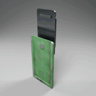</a><br><code>badge_id_holder_clip</code></td>
<td align="center"><a href="gifs/bookcase2_seed_0261.gif">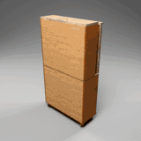</a><br><code>bookcase2</code></td>
<td align="center"><a href="gifs/car_axles_seed_0112.gif">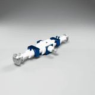</a><br><code>car_axles</code></td>
</tr>
<tr>
<td align="center"><a href="gifs/coaxial_rotary_stack_seed_0119.gif">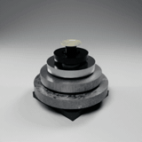</a><br><code>coaxial_rotary_stack</code></td>
<td align="center"><a href="gifs/drafting_table_with_adjustable_tilt_surface_seed_0145.gif">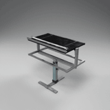</a><br><code>drafting_table_with_adjustable_tilt_surface</code></td>
<td align="center"><a href="gifs/fingerlike_phalanx_chain_seed_0056.gif">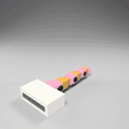</a><br><code>fingerlike_phalanx_chain</code></td>
<td align="center"><a href="gifs/greenhouse_vent_roof_seed_0030.gif">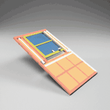</a><br><code>greenhouse_vent_roof</code></td>
</tr>
<tr>
<td align="center"><a href="gifs/industrial_crane_featuring_advanced_hydraulic_seed_0003.gif">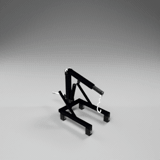</a><br><code>industrial_crane_featuring_advanced_hydraulic</code></td>
<td align="center"><a href="gifs/louvered_shutter_assembly_seed_0576.gif">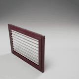</a><br><code>louvered_shutter_assembly</code></td>
<td align="center"><a href="gifs/mechanical_timer_with_rotating_dial_seed_0142.gif">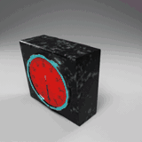</a><br><code>mechanical_timer_with_rotating_dial</code></td>
<td align="center"><a href="gifs/overhead_projector_with_articulating_mirror_seed_0009.gif">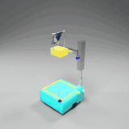</a><br><code>overhead_projector_with_articulating_mirror</code></td>
</tr>
<tr>
<td align="center"><a href="gifs/pilers_needle_nose_pliers_seed_0044.gif">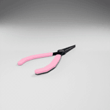</a><br><code>pilers_needle_nose_pliers</code></td>
<td align="center"><a href="gifs/ratchet_strap_seed_0012.gif">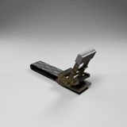</a><br><code>ratchet_strap</code></td>
<td align="center"><a href="gifs/rope_pulley_seed_0007.gif">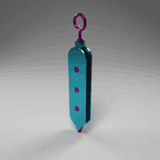</a><br><code>rope_pulley</code></td>
<td align="center"><a href="gifs/sewing_machine_seed_0005.gif">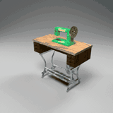</a><br><code>sewing_machine</code></td>
</tr>
<tr>
<td align="center"><a href="gifs/soft_pneumatic_gripper_seed_0020.gif">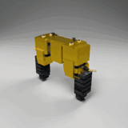</a><br><code>soft_pneumatic_gripper</code></td>
<td align="center"><a href="gifs/telescoping_boom_seed_2840.gif">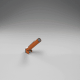</a><br><code>telescoping_boom</code></td>
<td align="center"><a href="gifs/turnstile_gates_seed_0020.gif">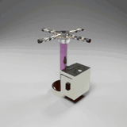</a><br><code>turnstile_gates</code></td>
<td align="center"><a href="gifs/water_filter_pump_seed_0154.gif">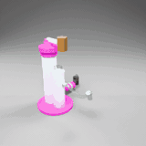</a><br><code>water_filter_pump</code></td>
</tr>
</table>

## Specs

| Property | Value |
| --- | --- |
| Clips | 1066 `.gif` |
| Categories | 531 |
| Resolution | 384 x 384 |
| Frames per clip | 50 |
| Frame rate | 10 fps |
| Duration | 5 s |
| Per-file size | 0.5 - 3.9 MB |
| Total size | ~2.1 GB |

## Layout

```
gifs/          # all 1066 clips, flat
thumbs/        # 48 lightweight 160x160 previews used by the gallery above
manifest.csv   # per-clip category lookup
```

## Naming

```
<category>_seed_<id>.gif
```

Example: `Astronomy_Mars_rover_seed_0068.gif` is seed `0068` of category `Astronomy_Mars_rover`.
529 categories have two clips; `Door_Gate` and `Kitchen_Toaster` have four.

## Per-clip category list

[`manifest.csv`](manifest.csv) maps every clip to its category and seed:

```csv
file,category,seed
Accessories_Cushion_seed_0020.gif,Accessories_Cushion,0020
Accessories_Cushion_seed_0042.gif,Accessories_Cushion,0042
Accessories_glasses_seed_0005.gif,Accessories_glasses,0005
...
```

## Category index

<details>
<summary>All 531 categories</summary>

| Category | Clips |
| --- | --- |
| `Accessories_Cushion` | 2 |
| `Accessories_glasses` | 2 |
| `adjustable_monitor_arm` | 2 |
| `Air_blower` | 2 |
| `animal_feeding_bowl_stand` | 2 |
| `aquarium` | 2 |
| `Art_Drawing_Models_Articulated_mannequin_Poseable_figure_mannequin` | 2 |
| `articulated_task_lamp` | 2 |
| `astronomical_telescope_on_tripod` | 2 |
| `Astronomy_Antenna_dish` | 2 |
| `Astronomy_Astronaut_helmet` | 2 |
| `Astronomy_Lunar_rover` | 2 |
| `Astronomy_Mars_rover` | 2 |
| `Astronomy_Pressurised_module_door` | 2 |
| `Astronomy_Retractable_landing_gear` | 2 |
| `Astronomy_Return_capsule` | 2 |
| `Astronomy_Rocket_engine` | 2 |
| `Astronomy_Satellite` | 2 |
| `Astronomy_Space_shuttle` | 2 |
| `automotive_differential_differential_gear` | 2 |
| `badge_id_holder_clip` | 2 |
| `Bag_Suitcase_Box` | 2 |
| `Bag_Suitcase_Luggage_bag` | 2 |
| `Bag_Suitcase_Shopping_bucket` | 2 |
| `Bag_Suitcase_Suitcase` | 2 |
| `Bag_Suitcase_Treasure_chest` | 2 |
| `ball_transfer_unit_with_spring_loaded_ball` | 2 |
| `ball_valve_with_quarter_turn_handle` | 2 |
| `Bar_Piano` | 2 |
| `barcode_scanner` | 2 |
| `barrier_gate_boom` | 2 |
| `barrier_gate_leaf_gate` | 2 |
| `Bathroom_Hair_dryer` | 2 |
| `Bathroom_toilet` | 2 |
| `Bathroom_washmachine` | 2 |
| `bell_tower_with_swinging_bell` | 2 |
| `Bench_Wood_Swing` | 2 |
| `bevel_gear_pair_with_perpendicular_shafts` | 2 |
| `bi_fold_closet_door_system` | 2 |
| `bicycle_crankset_and_pedal_assembly` | 2 |
| `bird_cage` | 2 |
| `blender_countertop` | 2 |
| `bookcase` | 2 |
| `bookcase1` | 2 |
| `bookcase2` | 2 |
| `Bookshelf_with_books` | 2 |
| `box_fan_with_control_knob` | 2 |
| `branching_tree_with_three_independent_rotary_branches` | 2 |
| `branching_tree_with_two_independent_rotary_branches` | 2 |
| `Butter_maker` | 2 |
| `butterfly_valve_with_lever_operator` | 2 |
| `C_shaped_sofa_side_table` | 2 |
| `Cabinet_with_doors` | 2 |
| `Cabinet_with_doors_and_drawers` | 2 |
| `Cabinet_with_drawers` | 2 |
| `Cabinet_with_glass_lift_up_vitrine` | 2 |
| `camcorder_with_flipout_screen` | 2 |
| `camera_flash` | 2 |
| `camera_lens` | 2 |
| `camp_chair` | 2 |
| `camping_lantern` | 2 |
| `candy_vending_machine` | 2 |
| `cannon` | 2 |
| `cantilever_articulated_arm` | 2 |
| `car_axles` | 2 |
| `car_scissor_jack_with_screw_mechanism` | 2 |
| `cash_register` | 2 |
| `casino_machine` | 2 |
| `cat_flap` | 2 |
| `cctv_mast_with_pantilt_camera_head` | 2 |
| `ceiling_fan` | 2 |
| `ceiling_light_fixture_adjustable` | 2 |
| `centrifuge_machine1` | 2 |
| `centrifuge_machine2` | 2 |
| `Chain_separator` | 2 |
| `Chair_Chair` | 2 |
| `Chair_Folding_chair` | 2 |
| `chest_freezer_with_hinged_lid` | 2 |
| `clock_tower_with_rotating_hour_and_minute_hands` | 2 |
| `clothing_rack` | 2 |
| `coaxial_rotary_stack` | 2 |
| `compass` | 2 |
| `Container_Barrel` | 2 |
| `Container_Basket` | 2 |
| `Container_Bottle` | 2 |
| `Container_Bottle_serum` | 2 |
| `Container_Box` | 2 |
| `Container_Can` | 2 |
| `Container_Cosmetic` | 2 |
| `Container_Cup` | 2 |
| `Container_Dispenser` | 2 |
| `Container_Gas_cylinder` | 2 |
| `Container_Glass_bottle` | 2 |
| `Container_Jar` | 2 |
| `Container_Kettle` | 2 |
| `Container_laundry_detergent_bottle` | 2 |
| `Container_Lipstick` | 2 |
| `Container_Locker` | 2 |
| `Container_Paint_spray` | 2 |
| `Container_Plastic_can` | 2 |
| `Container_Primer_bottle` | 2 |
| `Container_Pump` | 2 |
| `Container_Shipping_container` | 2 |
| `Container_Tube` | 2 |
| `crane_tower` | 2 |
| `crimping_tool` | 2 |
| `Curtain_blind` | 2 |
| `defibrillator_case` | 2 |
| `desk_with_drawer` | 2 |
| `desk_with_drawer_card_catalog` | 2 |
| `Desk_with_drawers_no_door` | 2 |
| `desktop_monitor_with_tilt_swivel_stand` | 2 |
| `desktop_pc_tower` | 2 |
| `differential_drive_wheel` | 2 |
| `dishwasher_with_dropdown_door_and_sliding_racks` | 2 |
| `display_freezer_with_sliding_glass_lids` | 2 |
| `dj_equipment` | 2 |
| `Door_Door` | 2 |
| `Door_Double_Door` | 2 |
| `Door_folding_door` | 2 |
| `Door_Folding_gate` | 2 |
| `Door_Garage_shutter` | 2 |
| `Door_Gate` | 4 |
| `Door_Other` | 2 |
| `Door_Scifi_Gate` | 2 |
| `Door_Sliding_Door` | 2 |
| `Door_Trap_door` | 2 |
| `Door_wooden_plank_door_with_a_ring_pull` | 2 |
| `drafting_table` | 2 |
| `drafting_table_with_adjustable_tilt_surface` | 2 |
| `drawer_cabinet_with_sliding_drawers` | 2 |
| `drawing_compass_with_adjustable_legs` | 2 |
| `Dressing_table` | 2 |
| `drone` | 2 |
| `drum_pedal_with_beater_and_spring_return` | 2 |
| `dual_independent_finger_chains` | 2 |
| `Electrical_Wiring_Cable_reel` | 2 |
| `Electrical_Wiring_Circuit_breaker` | 2 |
| `Electrical_Wiring_Conduit_bender` | 2 |
| `Electrical_Wiring_Distribution_board_panel` | 2 |
| `Electrical_Wiring_Junction_box` | 2 |
| `Electrical_Wiring_Surge_protector_switch` | 2 |
| `Electrical_Wiring_Wire_stripper` | 2 |
| `elevator_button_panel` | 2 |
| `elevator_shaft` | 2 |
| `emergency_exit_door` | 2 |
| `Equipment_Control_panel` | 2 |
| `Equipment_Game_console` | 2 |
| `Equipment_LED_work_light` | 2 |
| `Equipment_Lock` | 2 |
| `Equipment_Pipeline` | 2 |
| `Equipment_Power_switch` | 2 |
| `Equipment_Pump2` | 2 |
| `ergonomic_clamp_with_adjustable` | 2 |
| `ergonomic_clamp_with_adjustable_components` | 2 |
| `fabric_scissors` | 2 |
| `Facade_Element_Air_conditioner_outdoor_unit` | 2 |
| `Facade_Element_Gutter_downchain` | 2 |
| `Facade_Element_Lamp1` | 2 |
| `Fence_Cascade_fences` | 2 |
| `ferris_wheel` | 2 |
| `fingerlike_phalanx_chain` | 2 |
| `fire_escape_ladder` | 2 |
| `flaring_tool_with_cone_and_clamp` | 2 |
| `flexible_track_lighting_system` | 2 |
| `Floor_standing_drafting_table` | 2 |
| `folders` | 2 |
| `folding_arm_chain` | 2 |
| `folding_camp_table` | 2 |
| `Folding_ruler` | 2 |
| `Folding_sofa_bed` | 2 |
| `Folding_sofa_bed1` | 2 |
| `Folding_sofa_bed2` | 2 |
| `Folding_sofa_bed3` | 2 |
| `Folding_table` | 2 |
| `Folding_table1` | 2 |
| `Folding_table2` | 2 |
| `Folding_table3` | 2 |
| `Folding_table4` | 2 |
| `Folding_table5` | 2 |
| `Fountain_Drick_fountain` | 2 |
| `full_height_turnstile` | 2 |
| `Garden_pruner` | 2 |
| `garlic_press` | 2 |
| `gear_assemblies` | 2 |
| `generator` | 2 |
| `globe` | 2 |
| `Golf_cart` | 2 |
| `graphics_card_with_cooling_fans` | 2 |
| `greenhouse_vent_roof` | 2 |
| `guitar_tuning_peg_mechanism` | 2 |
| `gyroscope_with_spinning_wheel_and_gimbal_rings` | 2 |
| `Hall_tree_with_flip_top_seat` | 2 |
| `hamster_wheel` | 2 |
| `Hand_crank_clothes_wringer` | 2 |
| `hand_cultivator` | 2 |
| `hand_operated_metal_brake_for_bending_sheet_metal` | 2 |
| `hand_operated_pasta_maker_with_rollers_and_crank` | 2 |
| `Handtools_caulking_gun` | 2 |
| `Handtools_Clamp` | 2 |
| `Handtools_clothes_peg` | 2 |
| `Handtools_dial_caliper` | 2 |
| `Handtools_Hand_plane` | 2 |
| `Handtools_Knife` | 2 |
| `Handtools_Paint_roller` | 2 |
| `Handtools_Pen` | 2 |
| `Handtools_Stapler` | 2 |
| `Handtools_Tool_cart` | 2 |
| `Handtools_wooden_tongs` | 2 |
| `Handtools_Wrench` | 2 |
| `harmonic_drive` | 2 |
| `harvester` | 2 |
| `Headwear_Racing_helmet` | 2 |
| `Healthcare_Adjustable_hospital_bed` | 2 |
| `Healthcare_Crutches` | 2 |
| `Healthcare_First_aid_box` | 2 |
| `Healthcare_Pill_bottle_box` | 2 |
| `Healthcare_Prosthetic_limb` | 2 |
| `Healthcare_Wheelchair` | 2 |
| `Hole_punch` | 2 |
| `hole_punch` | 2 |
| `Household_Laundry_Clothes_drying_rack_Laundry_drying_rack` | 2 |
| `Hutch_Cabinet` | 2 |
| `hydraulic_jack` | 2 |
| `hydraulic_jack1` | 2 |
| `hydraulic_jack2` | 2 |
| `Ice_crream_machine` | 2 |
| `immersion_blender` | 2 |
| `Industrial_Blast_door` | 2 |
| `industrial_crane_featuring_advanced_hydraulic` | 2 |
| `Industrial_Drill_press_table` | 2 |
| `Industrial_Electric_Saw` | 2 |
| `Industrial_Hydraulic_press` | 2 |
| `Industrial_Industrial_vice` | 2 |
| `Industrial_Mine_cart` | 2 |
| `Industrial_Ore_crusher_jaw` | 2 |
| `Industrial_rolling_work_table` | 2 |
| `Industrial_Safety_cage` | 2 |
| `ironing_board` | 2 |
| `ironing_board2` | 2 |
| `jet_engine` | 2 |
| `juicer_press_with_handle` | 2 |
| `Kitchen_Air_fryer` | 2 |
| `kitchen_cabinet` | 2 |
| `Kitchen_Coffee_machine` | 2 |
| `Kitchen_Corkscrew` | 2 |
| `Kitchen_Dish_washer` | 2 |
| `Kitchen_Hood` | 2 |
| `Kitchen_Knife_set` | 2 |
| `Kitchen_Microwave` | 2 |
| `Kitchen_set` | 2 |
| `Kitchen_Toaster` | 4 |
| `laptop_stand` | 2 |
| `laser_level_tripod` | 2 |
| `lazy_susan` | 2 |
| `lever_chain` | 2 |
| `Lid_opener` | 2 |
| `Light_Latern` | 2 |
| `linear_actuator` | 2 |
| `linear_bearing_slide_with_rail` | 2 |
| `Locker_box` | 2 |
| `loom_shuttle` | 2 |
| `louvered_shutter_assembly` | 2 |
| `Machinery_Watermill` | 2 |
| `makeup` | 2 |
| `makeup1` | 2 |
| `makeup2` | 2 |
| `makeup3` | 2 |
| `manual_coffee_grinder` | 2 |
| `manual_grain_mill1` | 2 |
| `manual_grain_mill2` | 2 |
| `manual_hand_drill` | 2 |
| `manual_pipe_bender` | 2 |
| `manual_water_dispenser_pump` | 2 |
| `meat_grinder` | 2 |
| `Mechanical_calculator` | 2 |
| `mechanical_metronome_with_pendulum` | 2 |
| `mechanical_timer_with_rotating_dial` | 2 |
| `metal_blender` | 2 |
| `metronome` | 2 |
| `microphone_boom_arm` | 2 |
| `Military_Aircraft` | 2 |
| `Military_Granade` | 2 |
| `Military_Gun` | 2 |
| `Military_helicopter` | 2 |
| `Military_knife` | 2 |
| `Military_Military_knife` | 2 |
| `Military_Radio` | 2 |
| `Military_Rifle` | 2 |
| `Military_sword` | 2 |
| `Military_Tank` | 2 |
| `Military_Turret` | 2 |
| `missile_launcher` | 2 |
| `miter_saw_arm_assembly` | 2 |
| `monitor_mount` | 2 |
| `multisegment_foldout_arm` | 2 |
| `Music_Amplifier` | 2 |
| `Music_CD_case` | 2 |
| `Music_Headphone` | 2 |
| `Music_keyboard` | 2 |
| `music_stand` | 2 |
| `music_stand1` | 2 |
| `Music_Violin_case` | 2 |
| `Music_Vocal_mic` | 2 |
| `n_joint_revolute_chain` | 2 |
| `needle_case` | 2 |
| `nutcracker` | 2 |
| `office_table_with_doors_or_drawers` | 2 |
| `Other_Air_conditioner` | 2 |
| `Other_armchair` | 2 |
| `Other_Bedside` | 2 |
| `Other_Built_in_oven` | 2 |
| `Other_Cabinet` | 2 |
| `Other_cauldron` | 2 |
| `Other_Coffin` | 2 |
| `Other_Folding_screen` | 2 |
| `Other_high_arc_gooseneck_faucet` | 2 |
| `Other_Lighter` | 2 |
| `Other_Metal_drain` | 2 |
| `Other_pliers` | 2 |
| `Other_Scale` | 2 |
| `Other_single_hole_basin_faucet` | 2 |
| `Other_stove` | 2 |
| `Other_Switch` | 2 |
| `Other_Tripod_Turnstile` | 2 |
| `Other_TV` | 2 |
| `Other_Vent` | 2 |
| `Other_Water_dispenser` | 2 |
| `Other_widespread_two_handle_faucet` | 2 |
| `Others_Binocular` | 2 |
| `Others_blacksmith_tongs` | 2 |
| `Others_Matchbox` | 2 |
| `Others_Safe` | 2 |
| `overhead_projector_with_articulating_mirror` | 2 |
| `overshot_waterwheel` | 2 |
| `paper_cutter_guillotine` | 2 |
| `paper_shredder` | 2 |
| `parabolic_dish_on_azimuth_elevation_mount` | 2 |
| `Parts_quick_release_clamp` | 2 |
| `pepper_mill_with_rotating_grinder_mechanism` | 2 |
| `pet_carrier` | 2 |
| `pet_stroller` | 2 |
| `piano_bench` | 2 |
| `pilers_cutting_pliers` | 2 |
| `pilers_fencing_pliers` | 2 |
| `pilers_linesman_pliers` | 2 |
| `pilers_locking_pliers` | 2 |
| `pilers_needle_nose_pliers` | 2 |
| `pilers_slip_joint_pliers` | 2 |
| `pilers_tongue_groove_pliers` | 2 |
| `pilers_wire_strippers` | 2 |
| `platform_cart` | 2 |
| `Playground_playground_chair_swing_carousel` | 2 |
| `Playground_playground_merry_go_round` | 2 |
| `Playground_Seesaw` | 2 |
| `Playground_swing` | 2 |
| `playground_swing` | 2 |
| `Playground_swing_circular` | 2 |
| `point_of_sale_terminal` | 2 |
| `Powertools_angle_grinder` | 2 |
| `Powertools_drill` | 2 |
| `Powertools_Lawn_mower` | 2 |
| `projector` | 2 |
| `protractor_with_swing_arm` | 2 |
| `pulley` | 2 |
| `pushpull_plunger_chain` | 2 |
| `rabbit_hutch` | 2 |
| `rack_and_pinion_slider` | 2 |
| `ratchet_strap` | 2 |
| `refrigerator_with_hinged_doors` | 2 |
| `remote_weapon_station` | 2 |
| `retractable_patio_awning` | 2 |
| `retractable_utility_knife` | 2 |
| `revolving_door` | 2 |
| `ring_blinder` | 2 |
| `riot_shield` | 2 |
| `rivet_squeeze` | 2 |
| `rivet_squeeze1` | 2 |
| `robotic_arms` | 2 |
| `robotic_leg` | 2 |
| `roller_conveyor` | 2 |
| `rolling_toolbox_with_telescoping_handle` | 2 |
| `rope_pulley` | 2 |
| `rotary_table_with_tilting_trunnion` | 2 |
| `rotating_observatory_dome` | 2 |
| `round_cabinet` | 2 |
| `sailboat_winch_with_pawl_and_handle` | 2 |
| `satellite_with_articulated_solar_panels` | 2 |
| `scanner` | 2 |
| `Science_Capsule` | 2 |
| `Science_Dental_setup` | 2 |
| `Science_First_aid_cabinet` | 2 |
| `Science_microscope` | 2 |
| `Science_Surgical_bed` | 2 |
| `Science_Surgical_chair` | 2 |
| `Science_Syringe` | 2 |
| `screwcap_bottle` | 2 |
| `screwin_light_bulb_with_socket` | 2 |
| `searchlight_tower` | 2 |
| `seed_spreader` | 2 |
| `seeder` | 2 |
| `serial_elbow_arm` | 2 |
| `sewing_machine` | 2 |
| `shelving_unit_with_adjustable_shelves` | 2 |
| `shelving_unit_with_folding_shelves` | 2 |
| `shoulderelbowwrist_arm` | 2 |
| `Sign_sign` | 2 |
| `simple_aframe_step_ladder` | 2 |
| `simple_drying_rack` | 2 |
| `single_revolute_hinge` | 2 |
| `single_rotor_helicopter` | 2 |
| `single_wheelbarrow` | 2 |
| `singleleaf_drawbridge` | 2 |
| `sliding_turnstile` | 2 |
| `sliding_window_classic` | 2 |
| `sluice_gate_with_vertical_lift_panel` | 2 |
| `soft_pneumatic_gripper` | 2 |
| `speed_gate` | 2 |
| `Sports_Baby_cycle` | 2 |
| `Sports_Bike` | 2 |
| `Sports_Carabiner` | 2 |
| `Sports_Dumble` | 2 |
| `Sports_Exercise_bike` | 2 |
| `Sports_Fidget_Spinner` | 2 |
| `Sports_game_console` | 2 |
| `Sports_Karting` | 2 |
| `Sports_Roller_scates` | 2 |
| `Sports_Scooter_Racer` | 2 |
| `Sports_Skateboard` | 2 |
| `Sports_Skincare_Roller` | 2 |
| `Sports_Table_football` | 2 |
| `Sports_Toy_car` | 2 |
| `sprinkler_head_with_rotating_arms` | 2 |
| `Stairs_Escalator` | 2 |
| `stand_mixer` | 2 |
| `standing_desk_with_synchronous_telescoping_legs_and_articulated_controls` | 2 |
| `Stationary_Calculater` | 2 |
| `Stationary_Clip` | 2 |
| `Stationary_Clipboard` | 2 |
| `Stationary_Folder` | 2 |
| `Stationary_Pen` | 2 |
| `Stationary_Pencil_sharpener` | 2 |
| `Stationary_Scissors` | 2 |
| `storage_cart_with_drawers_on_wheels` | 2 |
| `stretcher` | 2 |
| `Structure_Elevator` | 2 |
| `studio_lamp` | 2 |
| `studio_spotlight_on_yoke` | 2 |
| `table_tennis_table` | 2 |
| `table_with_doors_and_drawers` | 2 |
| `table_with_drawers_no_door` | 2 |
| `tackle_box_with_simple_hinged_lid` | 2 |
| `tailor_s_dummy` | 2 |
| `Technology_Audio_Device` | 2 |
| `Technology_Conference_Phone` | 2 |
| `Technology_Flashlight` | 2 |
| `Technology_Graphics_Card` | 2 |
| `Technology_Keyboard` | 2 |
| `Technology_Laptop` | 2 |
| `Technology_Mobile_Phone` | 2 |
| `Technology_Monitor` | 2 |
| `Technology_Printer` | 2 |
| `Technology_Remote_Control` | 2 |
| `Technology_Security_Camera` | 2 |
| `Technology_Telescope` | 2 |
| `telescoping_boom` | 2 |
| `telescoping_fishing_rod` | 2 |
| `telescoping_pointer` | 2 |
| `threestage_telescoping_slide` | 2 |
| `tractor` | 2 |
| `traditional_windmill` | 2 |
| `trekking_pole_collapsible` | 2 |
| `tricycle` | 2 |
| `tripod` | 2 |
| `trombone` | 2 |
| `trumpet` | 2 |
| `tube_cutter` | 2 |
| `turnbuckle` | 2 |
| `turnstile_gates` | 2 |
| `turntable` | 2 |
| `tv_cabinet` | 2 |
| `tv_wall_mount` | 2 |
| `twojoint_prismatic_chain` | 2 |
| `twojoint_revolute_chain` | 2 |
| `universal_joint` | 2 |
| `Urban_Environment_bucket1` | 2 |
| `Urban_Environment_bucket2` | 2 |
| `Urban_Environment_Caster_Trolley` | 2 |
| `Urban_Environment_Caster_Trolley2` | 2 |
| `Urban_Environment_Draft_Wagon` | 2 |
| `Urban_Environment_Fire_cabinet` | 2 |
| `Urban_Environment_Fire_Extinguisher` | 2 |
| `Urban_Environment_Fire_Hydrant` | 2 |
| `Urban_Environment_Garbage_bin` | 2 |
| `Urban_Environment_Large_Trashcan` | 2 |
| `Urban_Environment_Mailbox` | 2 |
| `Urban_Environment_Manhole_cover` | 2 |
| `Urban_Environment_Phone_box` | 2 |
| `Urban_Environment_Public_toilet` | 2 |
| `Urban_Environment_Public_toilet1` | 2 |
| `Urban_Environment_Roof_antena` | 2 |
| `Urban_Environment_sci_fi_satellite_dish` | 2 |
| `Urban_Environment_Tilt_Truck1` | 2 |
| `Urban_Environment_Tilt_Truck2` | 2 |
| `Urban_Environment_Trashcan1` | 2 |
| `Urban_Environment_Trashcan2` | 2 |
| `Urban_Environment_utility_box` | 2 |
| `Urban_Environment_Well_lid` | 2 |
| `usb_drive_with_swivel_cover` | 2 |
| `vane_array_with_independent_pivots` | 2 |
| `Vehicle_Sports_car` | 2 |
| `waffle_maker` | 2 |
| `walking_cane` | 2 |
| `wall_safe_with_hinged_door_and_dial` | 2 |
| `watch` | 2 |
| `water_filter_pump` | 2 |
| `watering_can` | 2 |
| `wheelbarrow` | 2 |
| `wheelie_bin_with_hinged_lid` | 2 |
| `whiteboard_easel` | 2 |
| `wind_turbine` | 2 |
| `Window_Sliding_window` | 2 |
| `Window_Window` | 2 |
| `windshield_wiper_assembly` | 2 |
| `wine_cabinet` | 2 |
| `wine_cabinet1` | 2 |
| `wine_cabinet2` | 2 |
| `wine_rack` | 2 |
| `worm_gear_and_wheel_assembly` | 2 |
| `wrench_set` | 2 |
| `zippo_lighter` | 2 |

</details>

## Cloning

The repository is ~2.1 GB of binary data, so a shallow clone is recommended:

```bash
git clone --depth 1 https://github.com/zzzzfsfs/articulated-object-gifs.git
```

## Notes

- Clips are stored byte-for-byte as rendered; nothing is re-encoded.
- `thumbs/` contains downscaled derivatives (160 x 160, 10 fps, 64-colour palette) generated from the originals purely so the gallery above loads quickly. They are not part of the dataset.
- Each GIF contains only the standard `NETSCAPE2.0` looping extension block. There is no EXIF, XMP, comment or trailing data in any file.
